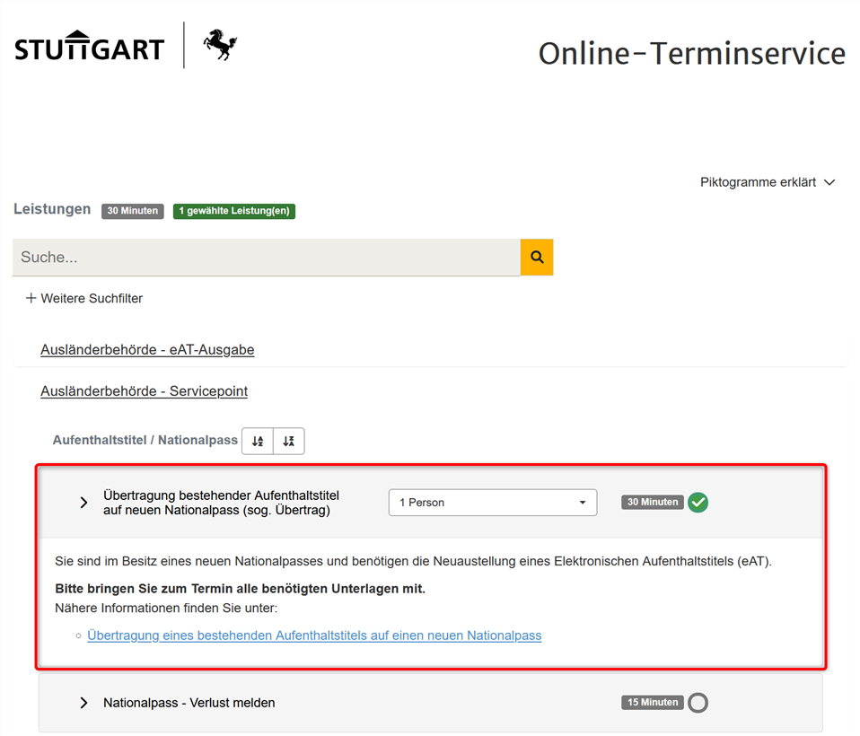

# Stuttgart Auslaender Appointment Notifier

[![License: MIT][license-badge]][license-docs]

Python script to check available appointments on the Stuttgart Immigration Office website: https://stuttgart.konsentas.de/form/7/?signup_new=1

## Table of Contents

- [ Getting Started](#-getting-started)
- [ About](#-about)
    - [ Released Features](#-released-features)
    - [ 3rd Party Licenses](#-3rd-party-licenses)
    - [ Used Encryption](#-used-encryption)
    - [ License](#-license)

## <a name="getting-started"/> Getting Started

To execute the script, simply run `python appointment_notifier.py` command or use the *RUN.bat* file.

## <a name="about"/> About

This repository contains several Python scripts with functionality for checking available appointments on the Stuttgart's Immigration Office website.
The **ntfy** app is used to send notifications to your phone when an appointment is available. Please note that **ntfy** app installation is required.

### <a name="released-features"/> Released Features

Repository contains the following features:
- checking and notifying about the available appointments for the `Übertragung bestehender Aufenthaltstitel auf neuen Nationalpass (sog. Übertrag)` service:

- checking and notifying about the available appointments for the `Aufenthaltstitel (eAT) - abholen (1 Person)` service:

### <a name="3rd-party-licenses"/> 3rd Party Licenses

This repository does not distribute any third-party software.

### <a name="used-encryption"/> Used Encryption

This repository does not contain or use encryption algorithms.

### <a name="license"/> License

[![License: MIT][license-badge]][license-docs]
This repository is released under the [MIT][license-docs] license.

[license-docs]: https://opensource.org/licenses/MIT
[license-badge]: https://img.shields.io/badge/License-MIT-yellow.svg
